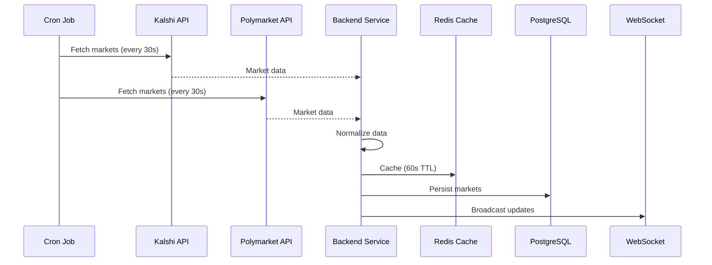
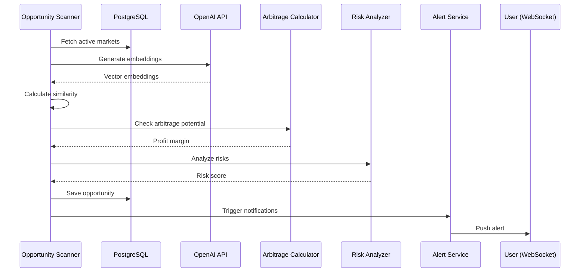

# 🏗️ Architecture Documentation

This document provides a comprehensive overview of the ArbitrageMarkets system architecture, design decisions, and technical implementation details.

## Table of Contents

- [System Overview](#system-overview)
- [Component Architecture](#component-architecture)
- [Data Flow](#data-flow)
- [Database Schema](#database-schema)
- [Caching Strategy](#caching-strategy)
- [API Endpoints](#api-endpoints)
- [WebSocket Communication](#websocket-communication)
- [Security Considerations](#security-considerations)
- [Scalability](#scalability)

---

## System Overview

ArbitrageMarkets is built as a modern web application using a three-tier architecture:

1. **Presentation Layer** - Next.js 14 frontend with real-time updates
2. **Application Layer** - Express/Fastify backend with business logic
3. **Data Layer** - PostgreSQL for persistence, Redis for caching

### Design Principles

- **Real-time First**: WebSocket connections for sub-second updates
- **AI-Enhanced**: Machine learning for intelligent market matching
- **Fault Tolerant**: Graceful degradation when APIs are unavailable
- **Type Safe**: End-to-end TypeScript for reliability
- **Observable**: Comprehensive logging and monitoring

---

## Component Architecture

### Frontend Components

```
app/
├── (dashboard)/
│   ├── page.tsx                    # Main dashboard
│   ├── opportunities/
│   │   └── page.tsx                # Opportunities list
│   ├── markets/
│   │   ├── kalshi/page.tsx         # Kalshi markets
│   │   └── polymarket/page.tsx     # Polymarket markets
│   └── settings/
│       └── page.tsx                # User preferences
├── components/
│   ├── OpportunityCard.tsx         # Arbitrage opportunity display
│   ├── MarketPairView.tsx          # Side-by-side market comparison
│   ├── RiskIndicator.tsx           # Risk assessment visualization
│   ├── ProfitCalculator.tsx        # ROI calculator
│   └── AlertsPanel.tsx             # Notification management
└── hooks/
    ├── useWebSocket.ts             # WebSocket connection management
    ├── useOpportunities.ts         # Opportunities data fetching
    └── useMarketData.ts            # Market data management
```

### Backend Services

```
src/
├── server.ts                       # Express/Fastify server setup
├── routes/
│   ├── opportunities.ts            # Opportunities API
│   ├── markets.ts                  # Markets API
│   ├── alerts.ts                   # Alerts API
│   └── websocket.ts                # WebSocket handlers
├── services/
│   ├── kalshi/
│   │   ├── client.ts               # Kalshi API client
│   │   ├── parser.ts               # Response normalization
│   │   └── types.ts                # Type definitions
│   ├── polymarket/
│   │   ├── client.ts               # Polymarket API client
│   │   ├── parser.ts               # Response normalization
│   │   └── types.ts                # Type definitions
│   ├── matching/
│   │   ├── embeddings.ts           # OpenAI embeddings
│   │   ├── similarity.ts           # Similarity scoring
│   │   └── matcher.ts              # Market pair matching
│   ├── arbitrage/
│   │   ├── calculator.ts           # Profit calculation
│   │   ├── risk-analyzer.ts        # Risk assessment
│   │   └── validator.ts            # Opportunity validation
│   └── notifications/
│       ├── email.ts                # Email alerts
│       └── websocket.ts            # Real-time push
├── jobs/
│   ├── market-fetcher.ts           # Scheduled market polling
│   ├── opportunity-scanner.ts      # Arbitrage detection
│   └── cleanup.ts                  # Data maintenance
└── db/
    ├── migrations/                 # Database schema versions
    ├── models/                     # ORM models
    └── queries/                    # Optimized queries
```

---

## Data Flow

### Market Data Ingestion



### Arbitrage Detection Flow



---

## Database Schema

### PostgreSQL Tables

#### `users`
```sql
CREATE TABLE users (
    id UUID PRIMARY KEY DEFAULT gen_random_uuid(),
    email VARCHAR(255) UNIQUE NOT NULL,
    encrypted_kalshi_key TEXT,
    encrypted_kalshi_secret TEXT,
    profit_threshold DECIMAL(5,2) DEFAULT 2.00,
    email_alerts_enabled BOOLEAN DEFAULT true,
    created_at TIMESTAMP DEFAULT NOW(),
    updated_at TIMESTAMP DEFAULT NOW()
);

CREATE INDEX idx_users_email ON users(email);
```

#### `markets`
```sql
CREATE TABLE markets (
    id UUID PRIMARY KEY DEFAULT gen_random_uuid(),
    platform VARCHAR(20) NOT NULL CHECK (platform IN ('kalshi', 'polymarket')),
    external_id VARCHAR(255) NOT NULL,
    title TEXT NOT NULL,
    description TEXT,
    category VARCHAR(100),
    yes_price DECIMAL(10,4),
    no_price DECIMAL(10,4),
    volume DECIMAL(15,2),
    liquidity DECIMAL(15,2),
    close_time TIMESTAMP,
    resolution_criteria TEXT,
    metadata JSONB,
    embedding vector(1536),
    is_active BOOLEAN DEFAULT true,
    last_updated TIMESTAMP DEFAULT NOW(),
    created_at TIMESTAMP DEFAULT NOW(),

    UNIQUE(platform, external_id)
);

CREATE INDEX idx_markets_platform ON markets(platform);
CREATE INDEX idx_markets_active ON markets(is_active) WHERE is_active = true;
CREATE INDEX idx_markets_embedding ON markets USING ivfflat (embedding vector_cosine_ops);
CREATE INDEX idx_markets_category ON markets(category);
```

#### `matched_pairs`
```sql
CREATE TABLE matched_pairs (
    id UUID PRIMARY KEY DEFAULT gen_random_uuid(),
    kalshi_market_id UUID NOT NULL REFERENCES markets(id),
    polymarket_market_id UUID NOT NULL REFERENCES markets(id),
    similarity_score DECIMAL(5,4) NOT NULL,
    match_method VARCHAR(50) NOT NULL CHECK (match_method IN ('embedding', 'manual', 'keyword')),
    verified BOOLEAN DEFAULT false,
    verified_by UUID REFERENCES users(id),
    resolution_risk VARCHAR(20) CHECK (resolution_risk IN ('low', 'medium', 'high')),
    notes TEXT,
    created_at TIMESTAMP DEFAULT NOW(),
    updated_at TIMESTAMP DEFAULT NOW(),

    UNIQUE(kalshi_market_id, polymarket_market_id)
);

CREATE INDEX idx_matched_pairs_kalshi ON matched_pairs(kalshi_market_id);
CREATE INDEX idx_matched_pairs_poly ON matched_pairs(polymarket_market_id);
CREATE INDEX idx_matched_pairs_verified ON matched_pairs(verified);
```

#### `opportunities`
```sql
CREATE TABLE opportunities (
    id UUID PRIMARY KEY DEFAULT gen_random_uuid(),
    matched_pair_id UUID NOT NULL REFERENCES matched_pairs(id),
    strategy VARCHAR(50) NOT NULL CHECK (strategy IN ('buy_kalshi_yes', 'buy_poly_yes', 'buy_kalshi_no', 'buy_poly_no')),
    kalshi_price DECIMAL(10,4) NOT NULL,
    polymarket_price DECIMAL(10,4) NOT NULL,
    profit_margin DECIMAL(5,2) NOT NULL,
    max_stake DECIMAL(15,2),
    risk_score DECIMAL(3,2),
    is_active BOOLEAN DEFAULT true,
    expires_at TIMESTAMP,
    created_at TIMESTAMP DEFAULT NOW(),

    CHECK (profit_margin >= 0)
);

CREATE INDEX idx_opportunities_active ON opportunities(is_active) WHERE is_active = true;
CREATE INDEX idx_opportunities_profit ON opportunities(profit_margin DESC);
CREATE INDEX idx_opportunities_created ON opportunities(created_at DESC);
```

#### `alerts`
```sql
CREATE TABLE alerts (
    id UUID PRIMARY KEY DEFAULT gen_random_uuid(),
    user_id UUID NOT NULL REFERENCES users(id),
    opportunity_id UUID NOT NULL REFERENCES opportunities(id),
    sent_at TIMESTAMP DEFAULT NOW(),
    method VARCHAR(20) CHECK (method IN ('email', 'websocket', 'push')),
    delivered BOOLEAN DEFAULT false,
    read BOOLEAN DEFAULT false,
    read_at TIMESTAMP
);

CREATE INDEX idx_alerts_user ON alerts(user_id);
CREATE INDEX idx_alerts_sent ON alerts(sent_at DESC);
```

---

## Caching Strategy

### Redis Cache Layers

#### Market Data Cache
```typescript
// Cache key pattern
const CACHE_KEY = {
  KALSHI_MARKETS: 'markets:kalshi:all',
  POLY_MARKETS: 'markets:polymarket:all',
  MARKET_BY_ID: (platform: string, id: string) => `market:${platform}:${id}`,
  OPPORTUNITIES: 'opportunities:active',
  USER_ALERTS: (userId: string) => `alerts:user:${userId}`
};

// TTL configuration
const TTL = {
  MARKET_DATA: 60,        // 60 seconds
  OPPORTUNITIES: 30,      // 30 seconds
  USER_PREFS: 300,        // 5 minutes
  EMBEDDINGS: 3600        // 1 hour
};
```

#### Cache Invalidation Strategy

```typescript
// Invalidate on market update
async function updateMarket(market: Market) {
  await db.markets.update(market);

  // Invalidate specific market
  await redis.del(CACHE_KEY.MARKET_BY_ID(market.platform, market.external_id));

  // Invalidate platform markets list
  await redis.del(CACHE_KEY[`${market.platform.toUpperCase()}_MARKETS`]);

  // Trigger opportunity recalculation
  await queueOpportunityScan(market.id);
}
```

---

## API Endpoints

### REST API

#### Markets

```
GET /api/markets/kalshi
  Query Params:
    - category: string (optional)
    - limit: number (default: 100)
    - offset: number (default: 0)
  Response: Market[]

GET /api/markets/polymarket
  Query Params:
    - category: string (optional)
    - limit: number (default: 100)
    - offset: number (default: 0)
  Response: Market[]

GET /api/markets/:platform/:id
  Path Params:
    - platform: 'kalshi' | 'polymarket'
    - id: string
  Response: Market
```

#### Opportunities

```
GET /api/opportunities
  Query Params:
    - min_profit: number (default: 0)
    - max_risk: 'low' | 'medium' | 'high'
    - limit: number (default: 50)
  Response: Opportunity[]

GET /api/opportunities/:id
  Path Params:
    - id: string (UUID)
  Response: Opportunity

POST /api/opportunities/calculate
  Body:
    - kalshi_market_id: string
    - polymarket_market_id: string
  Response: {
      profit_margin: number,
      strategy: string,
      risk_score: number,
      max_stake: number
    }
```

#### Matched Pairs

```
GET /api/matched-pairs
  Query Params:
    - verified: boolean
    - min_similarity: number (0-1)
  Response: MatchedPair[]

POST /api/matched-pairs
  Body:
    - kalshi_market_id: string
    - polymarket_market_id: string
    - manual: boolean
  Response: MatchedPair

PUT /api/matched-pairs/:id/verify
  Path Params:
    - id: string (UUID)
  Response: MatchedPair
```

#### Alerts

```
GET /api/alerts
  Query Params:
    - unread: boolean
    - limit: number
  Response: Alert[]

POST /api/alerts/subscribe
  Body:
    - min_profit_threshold: number
    - email_enabled: boolean
  Response: { success: boolean }

PUT /api/alerts/:id/read
  Path Params:
    - id: string (UUID)
  Response: Alert
```

---

## WebSocket Communication

### Connection Protocol

```typescript
// Client connection
const ws = new WebSocket('ws://localhost:3001/ws');

ws.onopen = () => {
  ws.send(JSON.stringify({
    type: 'subscribe',
    channels: ['opportunities', 'markets:kalshi', 'markets:polymarket']
  }));
};

// Server message types
type WSMessage =
  | { type: 'opportunity:new', data: Opportunity }
  | { type: 'opportunity:update', data: Opportunity }
  | { type: 'opportunity:expired', data: { id: string } }
  | { type: 'market:update', data: Market }
  | { type: 'alert', data: Alert };
```

### Message Flow

```
Client                          Server
  |                               |
  |-- subscribe: opportunities -->|
  |                               |
  |<-- opportunity:new -----------|
  |<-- opportunity:update --------|
  |                               |
  |-- unsubscribe: markets ------>|
  |                               |
  |<-- alert --------------------|
```

---

## Security Considerations

### API Key Storage

- User API keys encrypted at rest using AES-256-GCM
- Encryption key stored in environment variable, never committed
- Decryption only in memory during API calls
- Keys never logged or exposed in responses

### Rate Limiting

```typescript
// Rate limit configuration
const rateLimits = {
  api: {
    windowMs: 60 * 1000,      // 1 minute
    max: 100                   // 100 requests per minute
  },
  websocket: {
    connectionLimit: 5,        // 5 connections per IP
    messageLimit: 50           // 50 messages per minute
  }
};
```

### Input Validation

- All API inputs validated with Zod schemas
- SQL injection prevention via parameterized queries
- XSS protection with sanitization
- CORS configured for specific origins only

### Authentication & Authorization

```typescript
// JWT-based authentication
interface JWTPayload {
  userId: string;
  email: string;
  iat: number;
  exp: number;
}

// Middleware for protected routes
async function authenticate(req, res, next) {
  const token = req.headers.authorization?.split(' ')[1];
  if (!token) return res.status(401).json({ error: 'Unauthorized' });

  try {
    const payload = jwt.verify(token, process.env.JWT_SECRET);
    req.user = payload;
    next();
  } catch (err) {
    res.status(401).json({ error: 'Invalid token' });
  }
}
```

---

## Scalability

### Horizontal Scaling

- Stateless backend services for easy replication
- Redis for distributed session management
- WebSocket connections distributed via Redis pub/sub
- Database connection pooling (max 20 connections per instance)

### Performance Optimization

```typescript
// Database query optimization
const opportunities = await db.query(`
  SELECT
    o.*,
    mp.similarity_score,
    mk.title as kalshi_title,
    mp_market.title as poly_title
  FROM opportunities o
  JOIN matched_pairs mp ON o.matched_pair_id = mp.id
  JOIN markets mk ON mp.kalshi_market_id = mk.id
  JOIN markets mp_market ON mp.polymarket_market_id = mp_market.id
  WHERE o.is_active = true
    AND o.profit_margin >= $1
  ORDER BY o.profit_margin DESC
  LIMIT $2
`, [minProfit, limit]);
```

### Monitoring

- Application metrics via Prometheus
- Real-time error tracking with Sentry
- Performance monitoring with DataDog (optional)
- Custom dashboards for opportunity detection latency
- Alert thresholds for API failures

---

## Deployment Architecture

### Production Environment

```
                  ┌──────────────┐
                  │   Cloudflare │
                  │     CDN      │
                  └──────┬───────┘
                         │
                  ┌──────▼───────┐
                  │    Nginx     │
                  │ Load Balancer│
                  └──────┬───────┘
                         │
         ┌───────────────┼───────────────┐
         │               │               │
    ┌────▼────┐     ┌────▼────┐     ┌────▼────┐
    │ Next.js │     │ Next.js │     │ Next.js │
    │  (1)    │     │  (2)    │     │  (3)    │
    └────┬────┘     └────┬────┘     └────┬────┘
         │               │               │
         └───────────────┼───────────────┘
                         │
                  ┌──────▼───────┐
                  │   Backend    │
                  │   Cluster    │
                  └──────┬───────┘
                         │
         ┌───────────────┼───────────────┐
         │               │               │
    ┌────▼────┐     ┌────▼────┐     ┌────▼────┐
    │PostgreSQL│    │  Redis  │     │ OpenAI  │
    │ Primary  │    │ Cluster │     │   API   │
    └──────────┘    └─────────┘     └─────────┘
```

### Resource Requirements

**Minimum (Development)**
- CPU: 2 cores
- RAM: 4GB
- Storage: 20GB

**Recommended (Production)**
- CPU: 4+ cores
- RAM: 8GB+
- Storage: 100GB SSD
- Network: 1Gbps

---

For implementation details, see [DEVELOPMENT.md](DEVELOPMENT.md).
