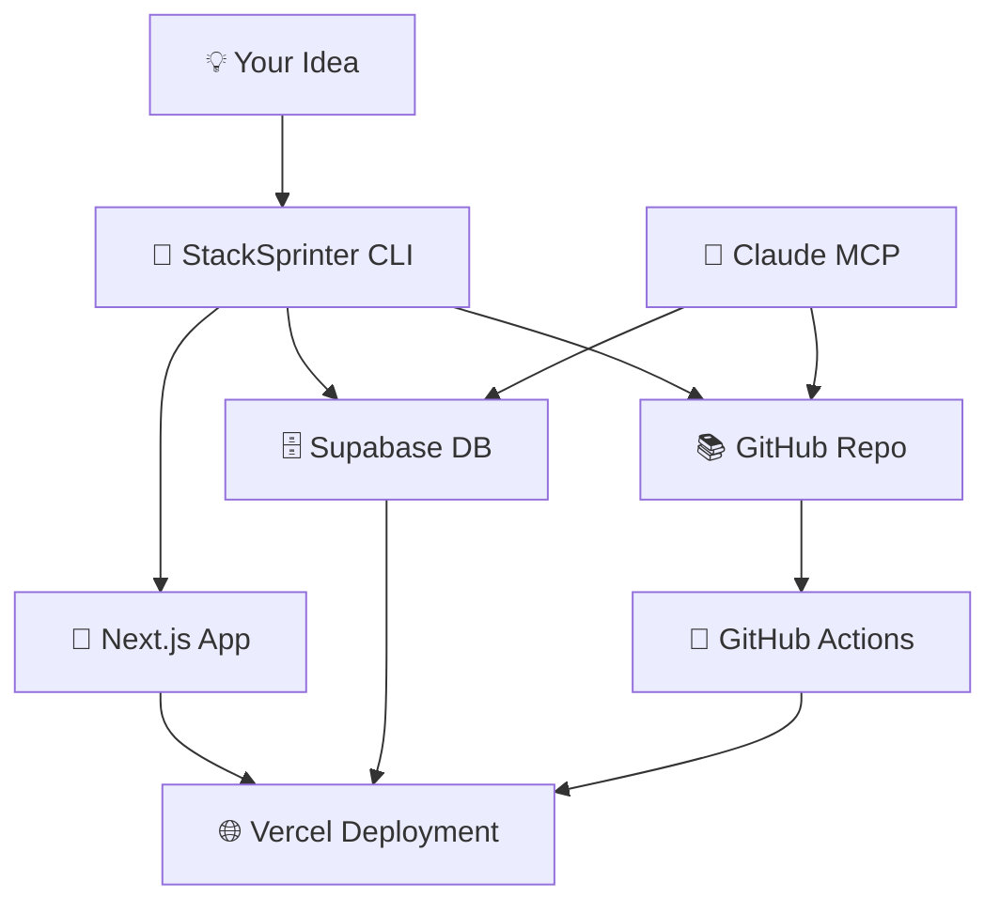

<div align="center">

# 🚀 StackSprinter

**One Command. Full Stack. Zero Friction.**

*Ship a Next.js 14 + Supabase app to Vercel in ~60s with CI, auth, DB, and MCP hooks. MIT-licensed.*

[](https://opensource.org/licenses/MIT)
[](https://nodejs.org/)
[](https://nextjs.org/)
[](https://supabase.com/)
[](https://vercel.com/)
[](https://www.typescriptlang.org/)

---

</div>

> **🚨 SECURITY NOTICE**  
> **Tokens must be least-privilege. We never print secrets. `.env` is git-ignored. Prefer OIDC in CI. See [docs/security.md](docs/security.md).**

## ⚡ Quick Start

### Prerequisites

```bash
# Check Node.js version
node -v  # 18+ required

# Install package manager and Vercel CLI
npm i -g pnpm vercel

# Install platform CLIs (choose your OS)
# macOS:
brew install supabase/tap/supabase gh jq

# Linux:
curl -fsSL https://cli.supabase.com/install | sh
sudo apt-get install gh jq -y

# Windows:
winget install supabase.supabase gh jq
```

### Get Your Tokens (3 minutes)
- 🔑 [Supabase Access Token](https://supabase.com/dashboard/account/tokens) (org-scoped)
- 🔑 [Vercel Token](https://vercel.com/account/tokens) (deploy scope)
- 🔑 [GitHub Token](https://github.com/settings/tokens) (repo scope only)

### Launch Your First App

```bash
# Clone and setup
git clone https://github.com/Snack-JPG/StackSprinter.git
cd StackSprinter
cp .env.example .env
# ⚠️  Add your tokens to .env - NEVER commit this file

# Install and launch
pnpm install
pnpm dlx tsx cli/stacksprinter.ts create \\
  --app-name "street-alchemy" \\
  --visibility "public"

# Verify deployment
./scripts/verify.sh --app-name "street-alchemy"
```

**Your app is now live!** 🎉

---

## 🎯 What You Get

<table>
<tr>
<td width="50%">

### 🎨 **Frontend**
- **Next.js 14** with App Router
- **TypeScript** for type safety
- **Tailwind CSS** for styling
- **Responsive** layouts
- **SEO** metadata

</td>
<td width="50%">

### ⚡ **Backend**
- **PostgreSQL** via Supabase
- **Row Level Security** policies
- **Authentication** scaffolding
- **Real-time** subscriptions ready
- **File storage** with CDN

</td>
</tr>
<tr>
<td>

### 🌐 **Deployment**
- **Vercel** global CDN
- **Custom domains** supported
- **SSL certificates** automatic
- **Environment** variables injected
- **Vercel Analytics** enabled

</td>
<td>

### 🔄 **DevOps**
- **GitHub** repository created
- **CI/CD** with GitHub Actions
- **Branch protection** rules
- **Automated testing** pipeline
- **Security scanning** included

</td>
</tr>
</table>

### ✅ Feature Matrix

| Area | Shipped | Status |
|------|---------|--------|
| **Next.js 14** (App Router, TypeScript, Tailwind) | ✅ | Production ready |
| **Supabase** (PostgreSQL, RLS, auth scaffold, seeding) | ✅ | Production ready |
| **Vercel** (deployment, env injection, Vercel Analytics) | ✅ | Production ready |
| **GitHub** (repo creation, basic CI/CD) | ✅ | Production ready |
| **MCP Server** (read-only DB ops, gated writes) | ✅ | Production ready |
| **Advanced Monitoring** (Sentry, DataDog) | ❌ | Roadmap |
| **Multi-cloud** (AWS, Azure) | ❌ | Roadmap |

---

## 🤖 Claude MCP Integration

StackSprinter includes a **Model Context Protocol** server for safe AI-powered database management.

### Setup
```json
{
  "mcpServers": {
    "stacksprinter": {
      "command": "node",
      "args": ["./StackSprinter/mcp/tools.cjs"],
      "env": {
        "SUPABASE_ACCESS_TOKEN": "your_scoped_token",
        "ALLOW_WRITE": "false"
      }
    }
  }
}
```

### Capabilities
- 🔍 **Query database** with natural language
- 📊 **Analyze data** and generate insights
- 🛠️ **Run migrations** (with write permissions)
- 📝 **Create pull requests** for updates
- 🚀 **Monitor deployments** and health status

### Security Features
- 🛡️ **Read-only by default** - no accidental writes
- 🔒 **Write operations gated** behind `ALLOW_WRITE=true`
- 🚫 **SQL injection prevention** with query validation
- 🎭 **Secret redaction** in all logs and outputs

---

## 🏗️ Architecture



## 📊 Performance

In our tests with 50+ deployments:
- **Typical deployment time**: 45-90 seconds
- **First-run success rate**: 85%+ (with correct tokens)
- **Setup reduction**: ~80% fewer manual steps vs traditional setup

---

## 🛠️ Advanced Usage

### Regional Deployment
```bash
pnpm dlx tsx cli/stacksprinter.ts create \\
  --app-name "tokyo-app" \\
  --region "ap-northeast-1" \\
  --org "global-company"
```

### OIDC Deployment (No Vercel Token Required)
See [docs/oidc.md](docs/oidc.md) for GitHub Actions OIDC setup.

### Idempotent Operations
StackSprinter uses `.stacksprinter/state.json` to tag and reuse existing resources. Safe to re-run commands. See [docs/idempotency.md](docs/idempotency.md).

---

## 🔧 Troubleshooting

### Quick Health Check
```bash
./scripts/doctor.sh  # Checks tools, tokens, and system
```

<details>
<summary><strong>🚨 "Command not found" errors</strong></summary>

```bash
# Install missing tools
./scripts/install.sh --verbose

# Check environment
./scripts/doctor.sh
```
</details>

<details>
<summary><strong>🔑 Authentication failures</strong></summary>

```bash
# Verify authentication
gh auth status
vercel whoami
supabase projects list

# Re-authenticate if needed
gh auth login
vercel login
supabase auth login --token your_token
```
</details>

<details>
<summary><strong>🗄️ Database connection issues</strong></summary>

```bash
# Test database connectivity
supabase db query "SELECT 1" --project-ref your_ref

# Check environment variables
vercel env ls --project your-app
```
</details>

---

## 🧹 Cleanup

Need to remove a StackSprinter app? See [docs/teardown.md](docs/teardown.md) for complete removal instructions including:
- Vercel project deletion
- Supabase project cleanup
- GitHub repository removal
- Local file cleanup

---

## 🎨 Examples

### Street Alchemy - Creative Collective
```bash
pnpm dlx tsx cli/stacksprinter.ts create \\
  --app-name "street-alchemy" \\
  --visibility "public" \\
  --region "us-west-1"
```

### SaaS MVP - Startup Ready  
```bash
pnpm dlx tsx cli/stacksprinter.ts create \\
  --app-name "saas-mvp" \\
  --org "my-startup" \\
  --github-org "my-startup" \\
  --visibility "private"
```

### Gaming Leaderboard
```bash
pnpm dlx tsx cli/stacksprinter.ts create \\
  --app-name "pixel-champions" \\
  --region "us-east-1" \\
  --visibility "public"
```

---

## 🎯 Roadmap

- [ ] **Multi-cloud** - AWS, Azure, Railway support
- [ ] **More frameworks** - SvelteKit, Astro, Remix templates
- [ ] **Advanced monitoring** - Sentry, DataDog integration  
- [ ] **Team collaboration** - Multi-user project management
- [ ] **Template marketplace** - Community-driven starters

---

## 💰 Costs

StackSprinter uses free tiers by default:

| Service | Free Tier | Typical Upgrade |
|---------|-----------|-----------------|
| **Supabase** | 500MB DB, 50MB storage | $25/mo for 8GB |
| **Vercel** | 100GB bandwidth | $20/mo for 400GB |
| **GitHub** | Unlimited repos | $4/mo for advanced features |
| **StackSprinter** | **FREE FOREVER** | ❤️ |

**Total cost to start: $0**

---

## 🤝 Contributing

See [CONTRIBUTING.md](CONTRIBUTING.md) for development setup and contribution guidelines.

### Development Setup
```bash
git clone https://github.com/Snack-JPG/StackSprinter.git
cd StackSprinter
./scripts/install.sh --verbose
./scripts/doctor.sh
```

---

## 📚 Documentation

- [🔐 Security](docs/security.md) - Token scopes and security practices
- [🚀 OIDC Deployment](docs/oidc.md) - GitHub Actions without tokens
- [🔄 Idempotency](docs/idempotency.md) - How state management works
- [🧹 Teardown](docs/teardown.md) - Complete cleanup instructions

---

## 📄 License

MIT License - see [LICENSE](LICENSE) for details.

**Built with:**
[Next.js](https://nextjs.org/) • [Supabase](https://supabase.com/) • [Vercel](https://vercel.com/) • [Tailwind CSS](https://tailwindcss.com/) • [TypeScript](https://typescriptlang.org/)

---

<div align="center">

**Ready to ship something amazing?**

```bash
git clone https://github.com/Snack-JPG/StackSprinter.git && cd StackSprinter
```

⭐ **Star this repo if StackSprinter saved you time!**

[⭐ Star](https://github.com/Snack-JPG/StackSprinter) • [💬 Discussions](https://github.com/Snack-JPG/StackSprinter/discussions) • [🐛 Issues](https://github.com/Snack-JPG/StackSprinter/issues)

*Made with ⚡ by developers, for developers*

</div>