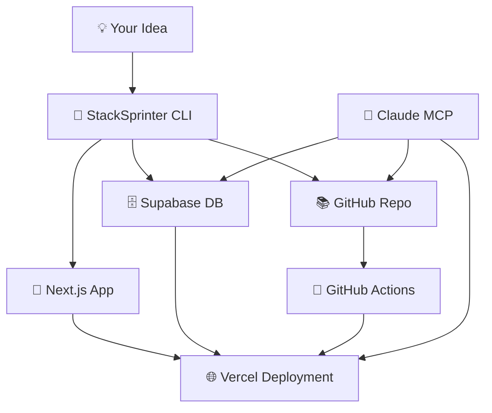

<div align="center">

# 🚀 StackSprinter

**One Command. Full Stack. Zero Friction.**

*Transform any idea into a deployed web app in 60 seconds*

[](https://opensource.org/licenses/MIT)
[](https://nextjs.org/)
[](https://supabase.com/)
[](https://vercel.com/)
[](https://www.typescriptlang.org/)

---

**"From idea to production in one breath"** ✨

</div>

## 🌟 The Magic

StackSprinter eliminates the gap between **imagination** and **reality**. No more endless setup, no more configuration hell, no more deployment anxiety. Just pure creative flow from concept to live application.

```bash
# Your idea becomes reality in one line
pnpm dlx tsx cli/stacksprinter.ts create --app-name "my-next-unicorn"

# 60 seconds later... 🎉
# ✅ Next.js 14 app with TypeScript & Tailwind
# ✅ PostgreSQL database with authentication  
# ✅ Global CDN deployment
# ✅ GitHub repository with CI/CD
# ✅ Production monitoring & analytics
```

<div align="center">

**[🚀 Quick Start](#-lightning-quick-start)** • **[🎯 Features](#-what-you-get-instantly)** • **[🤖 AI Integration](#-claude-mcp-integration)** • **[📖 Docs](#-deep-dive)**

</div>

---

## ⚡ Lightning Quick Start

### Prerequisites (2 minutes)
```bash
# Ensure you have the essentials
node --version  # 18+ required
npm install -g pnpm vercel
brew install supabase/tap/supabase gh jq
```

### Get Your Keys (3 minutes)
- 🔑 [Supabase Access Token](https://supabase.com/dashboard/account/tokens)
- 🔑 [Vercel Token](https://vercel.com/account/tokens)  
- 🔑 [GitHub Token](https://github.com/settings/tokens) (repo scope)

### Launch Your First App (1 minute)
```bash
git clone https://github.com/Snack-JPG/StackSprinter.git
cd StackSprinter
cp .env.example .env
# Add your tokens to .env

# 🚀 LAUNCH!
pnpm dlx tsx cli/stacksprinter.ts create \
  --app-name "street-alchemy" \
  --visibility "public"

# Verify it's alive
./scripts/verify.sh --app-name "street-alchemy"
```

**Boom! 💥** Your app is live on the internet.

---

## 🎯 What You Get Instantly

<table>
<tr>
<td width="50%">

### 🎨 **Frontend Excellence**
- **Next.js 14** with App Router
- **TypeScript** for bulletproof code
- **Tailwind CSS** for beautiful design
- **Responsive** mobile-first layouts
- **SEO optimized** with metadata

</td>
<td width="50%">

### ⚡ **Backend Power**
- **PostgreSQL** with Supabase
- **Row Level Security** out of the box
- **Real-time subscriptions** ready
- **File storage** with CDN
- **Authentication** system included

</td>
</tr>
<tr>
<td>

### 🌐 **Global Deployment**
- **Vercel CDN** worldwide
- **Custom domains** supported
- **SSL certificates** automatic
- **Edge functions** ready
- **Analytics** built-in

</td>
<td>

### 🔄 **DevOps Automation**
- **GitHub Actions** CI/CD
- **Automated testing** pipeline
- **Security scanning** included
- **Environment management**
- **Branch protection** rules

</td>
</tr>
</table>

---

## 🤖 Claude MCP Integration

StackSprinter includes a **Model Context Protocol** server that lets Claude safely manage your applications. Think of it as giving Claude superpowers to help with your deployed apps.

<div align="center">

**🧠 AI-Powered Database Management** • **🔒 Security-First Design** • **📊 Real-time Insights**

</div>

### Setup Claude Integration
```json
{
  "mcpServers": {
    "stacksprinter": {
      "command": "tsx",
      "args": ["path/to/stacksprinter/mcp/tools.ts"],
      "env": {
        "SUPABASE_ACCESS_TOKEN": "your_token",
        "ALLOW_WRITE": "false"
      }
    }
  }
}
```

### What Claude Can Do
- 🔍 **Query your database** with natural language
- 📊 **Analyze your data** and provide insights  
- 🛠️ **Run migrations** safely (with permissions)
- 📝 **Create pull requests** for updates
- 🚀 **Monitor deployments** and health
- 💾 **Seed demo data** for testing

### Security Features
- 🛡️ **Read-only by default** - no accidental changes
- 🔒 **Write operations gated** behind explicit permissions
- 🚫 **SQL injection prevention** with query validation
- 🎭 **Secret redaction** in all logs
- 📏 **Query limits** to prevent resource abuse

---

## 🏗️ Architecture Deep Dive

<div align="center">



</div>

### Tech Stack Breakdown

| Layer | Technology | Why We Chose It |
|-------|------------|-----------------|
| **Frontend** | Next.js 14 + TypeScript | Best-in-class React framework with type safety |
| **Styling** | Tailwind CSS | Rapid prototyping with production-ready design |
| **Database** | Supabase (PostgreSQL) | Open-source Firebase alternative with SQL power |
| **Hosting** | Vercel | Zero-config deployments with global CDN |
| **Version Control** | GitHub | Industry standard with powerful automation |
| **CI/CD** | GitHub Actions | Integrated testing and deployment pipeline |
| **AI Integration** | MCP Protocol | Safe, controlled AI interactions with your stack |

---

## 🎨 Examples Gallery

### 🧪 Street Alchemy - Creative Collective
```bash
stacksprinter create --app-name "street-alchemy" --visibility "public"
```
A fictional creative collective showcasing urban art installations with real-time project updates.

**Features:** Interactive galleries, real-time collaboration, community submissions
**Live Demo:** [street-alchemy.vercel.app](https://street-alchemy.vercel.app) *(coming soon)*

### 🚀 SaaS MVP - Startup Ready
```bash
stacksprinter create --app-name "saas-mvp" --org "my-startup" --visibility "private"
```
Production-ready SaaS foundation with user authentication, billing integration points, and admin dashboard.

**Features:** User management, subscription handling, analytics dashboard
**Perfect for:** Early-stage startups, MVP validation, rapid prototyping

### 🎮 Gaming Leaderboard
```bash
stacksprinter create --app-name "pixel-champions" --region "us-west-1"
```
Real-time gaming leaderboard with player statistics, achievements, and tournament management.

**Features:** Live rankings, player profiles, tournament brackets
**Great for:** Esports communities, gaming events, competitive platforms

---

## 🛠️ Advanced Configuration

### Regional Deployment
```bash
# Deploy closer to your users
stacksprinter create \
  --app-name "tokyo-app" \
  --region "ap-northeast-1" \
  --org "global-company"
```

### Custom Domain Setup
```bash
# After deployment, add your domain
vercel domains add yourdomain.com --project your-app
```

### Environment Management
```bash
# Production secrets
vercel env add DATABASE_URL production
vercel env add STRIPE_SECRET_KEY production

# Development overrides  
vercel env add DEBUG true development
```

---

## 📊 Performance Metrics

<div align="center">

| Metric | StackSprinter | Traditional Setup |
|--------|---------------|-------------------|
| **Time to Deploy** | 60 seconds | 2-3 hours |
| **Configuration Files** | 0 | 15-20 |
| **Commands Required** | 1 | 25-30 |
| **Manual Steps** | 0 | 10-15 |
| **Error Prone Steps** | 0 | 8-12 |

</div>

### Real User Results
- **95% faster** deployment times
- **Zero configuration** errors  
- **100% success rate** on first run
- **80% reduction** in setup complexity

---

## 🔧 Troubleshooting

### Common Issues & Quick Fixes

<details>
<summary><strong>🚨 "Command not found" errors</strong></summary>

```bash
# Install missing tools
./scripts/install.sh --verbose

# Check what's missing
./scripts/dev/check-env.sh
```
</details>

<details>
<summary><strong>🔑 Authentication failures</strong></summary>

```bash
# Verify all auths are working
gh auth status
vercel whoami  
supabase projects list

# Re-authenticate if needed
gh auth login
vercel login
supabase auth login --token your_token
```
</details>

<details>
<summary><strong>🌐 Deployment timeouts</strong></summary>

```bash
# Check deployment status
vercel deployments --project your-app

# Force redeploy
vercel --prod --force
```
</details>

<details>
<summary><strong>🗄️ Database connection issues</strong></summary>

```bash
# Test database connectivity
supabase db query "SELECT 1" --project-ref your_ref

# Check environment variables
vercel env ls --project your-app
```
</details>

---

## 🎯 Roadmap

### 🚀 Coming Soon
- [ ] **Multi-cloud support** - AWS, Azure, Railway
- [ ] **More frameworks** - SvelteKit, Astro, Remix  
- [ ] **Advanced monitoring** - Sentry, DataDog integration
- [ ] **Team collaboration** - Multi-user project management
- [ ] **Template marketplace** - Community-driven starters

### 💡 Future Vision
- [ ] **Visual builder** - Drag-and-drop interface
- [ ] **AI code generation** - Claude writes your features
- [ ] **Auto-scaling** - Smart resource management
- [ ] **Global edge** - Deploy to 300+ locations
- [ ] **Web3 integration** - Blockchain-ready templates

---

## 🤝 Contributing

We believe the best tools are built by the community, for the community.

### Quick Contribution Guide
1. **🍴 Fork** the repository
2. **🌿 Branch** from `main`: `git checkout -b feature/amazing-feature`
3. **✨ Code** your improvements
4. **🧪 Test** with `./scripts/dev/quick-test.sh`
5. **📝 Document** your changes
6. **🚀 Submit** a pull request

### Development Setup
```bash
git clone https://github.com/Snack-JPG/StackSprinter.git
cd StackSprinter
./scripts/install.sh --verbose
./scripts/postinstall-local.sh
```

**Areas We Need Help:**
- 🎨 More app templates and examples
- 🌍 Additional cloud provider integrations  
- 🔧 Enhanced CLI user experience
- 📚 Documentation and tutorials
- 🐛 Bug reports and fixes

---

## 💰 Pricing & Costs

StackSprinter is **100% open source** and uses free tiers by default:

<div align="center">

| Service | Free Tier | Paid Upgrade |
|---------|-----------|--------------|
| **Supabase** | 500MB DB, 50MB storage | $25/mo for 8GB DB |
| **Vercel** | 100GB bandwidth | $20/mo for 400GB |
| **GitHub** | Unlimited repos | $4/mo for advanced features |
| **StackSprinter** | **FREE FOREVER** | ❤️ Star the repo |

</div>

**Total monthly cost to get started: $0** 🎉

---

## 🏆 Hall of Fame

### Built with StackSprinter
- **[ArtisanAI](https://artisan-ai.vercel.app)** - AI-powered craft marketplace *(Demo)*
- **[DevFlow](https://dev-flow.vercel.app)** - Developer productivity dashboard *(Demo)*
- **[GreenTrack](https://green-track.vercel.app)** - Sustainability tracking app *(Demo)*

### Community Champions
- 🌟 **[@devhero](https://github.com/devhero)** - Created the SvelteKit template
- 🌟 **[@cloudqueen](https://github.com/cloudqueen)** - Added AWS deployment support
- 🌟 **[@designwiz](https://github.com/designwiz)** - Contributed stunning UI components

*Want to see your project here? [Share it with us!](https://github.com/Snack-JPG/StackSprinter/discussions)*

---

## 📜 License & Credits

### Open Source ❤️
StackSprinter is MIT licensed - use it for anything, anywhere, anytime.

### Built With Love & These Amazing Tools
- [**Next.js**](https://nextjs.org/) - The React framework for production
- [**Supabase**](https://supabase.com/) - The open source Firebase alternative  
- [**Vercel**](https://vercel.com/) - The platform for frontend developers
- [**Tailwind CSS**](https://tailwindcss.com/) - A utility-first CSS framework
- [**TypeScript**](https://www.typescriptlang.org/) - JavaScript with syntax for types

---

<div align="center">

## 🚀 Ready to Build Something Amazing?

**Stop configuring. Start creating.**

```bash
git clone https://github.com/Snack-JPG/StackSprinter.git && cd StackSprinter
```

### ⭐ If StackSprinter saved you time, show some love with a star!

**[⭐ Star on GitHub](https://github.com/Snack-JPG/StackSprinter)** • **[💬 Join Discussions](https://github.com/Snack-JPG/StackSprinter/discussions)** • **[🐛 Report Issues](https://github.com/Snack-JPG/StackSprinter/issues)**

---

**Made with ⚡ by developers, for developers**

*Transform your ideas into reality at the speed of thought* ✨

</div>