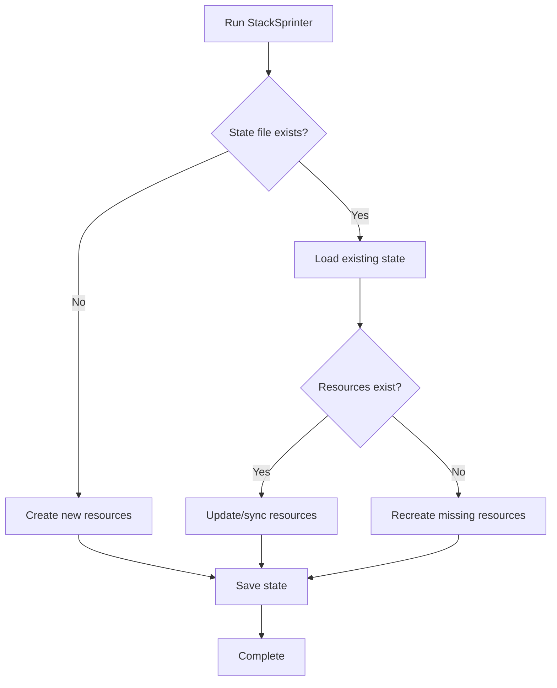

# 🔄 Idempotency Guide

StackSprinter is designed to be safely re-run. Understanding how state management works helps you confidently iterate on your applications.

## 🎯 How It Works

StackSprinter uses `.stacksprinter/state.json` to track what has been created and avoid duplicating resources.

### State File Structure

```json
{
  "appName": "street-alchemy",
  "supabaseProjectRef": "abcd1234efgh5678",
  "supabaseUrl": "https://abcd1234efgh5678.supabase.co",
  "supabaseAnonKey": "eyJhbGciOiJIUzI1NiIsInR5cCI6IkpXVCJ9...",
  "githubRepoUrl": "https://github.com/user/street-alchemy",
  "vercelProjectId": "street-alchemy",
  "vercelUrl": "https://street-alchemy.vercel.app",
  "createdAt": "2024-01-15T10:30:00.000Z",
  "lastUpdated": "2024-01-15T10:32:15.000Z"
}
```

### Resource Tagging

StackSprinter tags resources to identify them on subsequent runs:

**Supabase Projects**:
```typescript
// Projects are tagged with: stacksprinter:app-name
const tag = `stacksprinter:${appName}`;
await supabase.projects.create(projectName, { tags: [tag] });
```

**GitHub Repositories**:
```typescript
// Repositories include "Generated by StackSprinter" in description
const description = "Generated by StackSprinter";
```

**Vercel Projects**:
```typescript
// Projects are identified by exact name match
const projectName = appName.toLowerCase().replace(/[^a-z0-9-]/g, '-');
```

## ✅ Safe Re-run Scenarios

### 1. Failed Initial Run
```bash
# First run fails during Vercel deployment
pnpm dlx tsx cli/stacksprinter.ts create --app-name "my-app"
# ❌ Error: Vercel deployment timeout

# Re-run safely - will skip Supabase and GitHub setup
pnpm dlx tsx cli/stacksprinter.ts create --app-name "my-app"
# ✅ Resumes from Vercel deployment
```

### 2. Adding New Features
```bash
# Initial deployment
pnpm dlx tsx cli/stacksprinter.ts create --app-name "my-app"

# Later: Add new database tables
# Edit supabase/migrations/0002_new_feature.sql
pnpm dlx tsx cli/stacksprinter.ts create --app-name "my-app"
# ✅ Runs new migrations only
```

### 3. Configuration Changes
```bash
# Change region (will use existing project)
pnpm dlx tsx cli/stacksprinter.ts create \
  --app-name "my-app" \
  --region "eu-west-1"
# ✅ Updates configuration without recreating resources
```

## 🔍 State Detection Logic

### Supabase Project Detection
```typescript
async function findExistingSupabaseProject(appName: string): Promise<string | null> {
  const projects = await supabase.projects.list();
  
  // Look for exact name match
  const exactMatch = projects.find(p => p.name === appName);
  if (exactMatch) return exactMatch.id;
  
  // Look for tagged project
  const taggedProject = projects.find(p => 
    p.tags?.includes(`stacksprinter:${appName}`)
  );
  if (taggedProject) return taggedProject.id;
  
  return null;
}
```

### GitHub Repository Detection
```typescript
async function findExistingGitHubRepo(appName: string, org: string): Promise<string | null> {
  try {
    const repoPath = `${org}/${appName}`;
    await execCommand(`gh repo view ${repoPath}`);
    return `https://github.com/${repoPath}`;
  } catch {
    return null; // Repository doesn't exist
  }
}
```

### Vercel Project Detection
```typescript
async function findExistingVercelProject(appName: string): Promise<string | null> {
  const projects = await vercel.projects.list();
  const projectName = appName.toLowerCase().replace(/[^a-z0-9-]/g, '-');
  
  const existingProject = projects.find(p => p.name === projectName);
  return existingProject ? existingProject.id : null;
}
```

## ⚠️ Edge Cases

### Partial State Files
If state file is corrupted or incomplete:

```typescript
// StackSprinter validates state and rebuilds missing pieces
if (!state.supabaseProjectRef) {
  log('Supabase project ref missing, detecting existing project...');
  state.supabaseProjectRef = await findExistingSupabaseProject(appName);
}
```

### Resource Name Conflicts
If resources exist but aren't tagged:

```bash
# StackSprinter will ask for confirmation
⚠️  Found existing Supabase project 'my-app' but it's not tagged as StackSprinter-managed.
   
   Options:
   1. Link existing project (recommended)
   2. Create new project with different name
   3. Abort operation
   
   Choose [1]: 1
```

### Cross-Platform Consistency
State files work across different machines:

```json
{
  // Absolute paths are avoided
  "relativePaths": true,
  
  // Platform-agnostic identifiers
  "resourceIds": {
    "supabase": "project-ref-12345",
    "vercel": "deployment-id-67890",
    "github": "owner/repo"
  }
}
```

## 🔧 Manual State Management

### View Current State
```bash
# Check state file
cat my-app/.stacksprinter/state.json | jq '.'

# Verify resources exist
./scripts/verify.sh --app-name "my-app"
```

### Reset State
```bash
# Remove state to force fresh creation
rm -rf my-app/.stacksprinter/

# Re-run will create new resources
pnpm dlx tsx cli/stacksprinter.ts create --app-name "my-app"
```

### Merge States
If you have multiple state files:

```typescript
// merge-states.ts
import { readFileSync, writeFileSync } from 'fs';

const state1 = JSON.parse(readFileSync('app1/.stacksprinter/state.json', 'utf-8'));
const state2 = JSON.parse(readFileSync('app2/.stacksprinter/state.json', 'utf-8'));

const mergedState = {
  ...state1,
  ...state2,
  lastUpdated: new Date().toISOString()
};

writeFileSync('merged/.stacksprinter/state.json', JSON.stringify(mergedState, null, 2));
```

## 🚨 State File Best Practices

### Do's ✅
- **Commit state files to private repositories** for team coordination
- **Backup state files** before major operations
- **Verify state** with `./scripts/verify.sh` after operations
- **Check resource tags** in cloud consoles periodically

### Don'ts ❌
- **Don't manually edit state files** (use CLI commands)
- **Don't commit state to public repositories** (contains resource IDs)
- **Don't delete state files** without understanding consequences
- **Don't share state files** between different applications

## 📊 State Lifecycle



## 🔍 Debugging State Issues

### Common Commands
```bash
# Check what StackSprinter sees
pnpm dlx tsx cli/stacksprinter.ts verify --app-name "my-app" --verbose

# Compare state vs reality
supabase projects list | grep my-app
vercel project ls | grep my-app
gh repo list | grep my-app

# Reset and start fresh
rm -rf my-app/.stacksprinter/
pnpm dlx tsx cli/stacksprinter.ts create --app-name "my-app" --verbose
```

### State Validation
```typescript
function validateState(state: StackSprintState): boolean {
  const required = ['appName', 'supabaseProjectRef', 'vercelUrl'];
  return required.every(key => state[key]);
}
```

---

**Idempotency means you can run StackSprinter confidently, knowing it will do the right thing every time!** 🎯